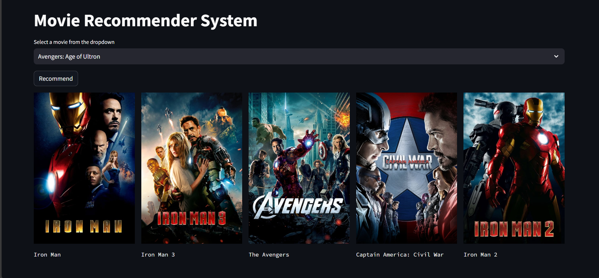

# MovieRecommender
Welcome to the Movie Recommender System project! This application is designed to recommend movies based on a selected movie title using **content-based filtering**. The project utilizes a combination of data processing, and machine learning techniques to provide movie recommendations.

# Table of Contents
- Overview
- Features
- License

# Overview
The Movie Recommender System uses a dataset of movies and their metadata to recommend similar movies to the user. The system processes the movie dataset to extract features such as **genres, keywords, cast, and crew**, and then uses cosine similarity to find movies that are similar to the selected movie.

# Features
**Movie Recommendation:** Recommends movies based on a selected movie title.  
**Poster Fetching:** Displays the poster of recommended movies.  
**User-Friendly Interface**: Interactive UI built with Streamlit for easy use.

